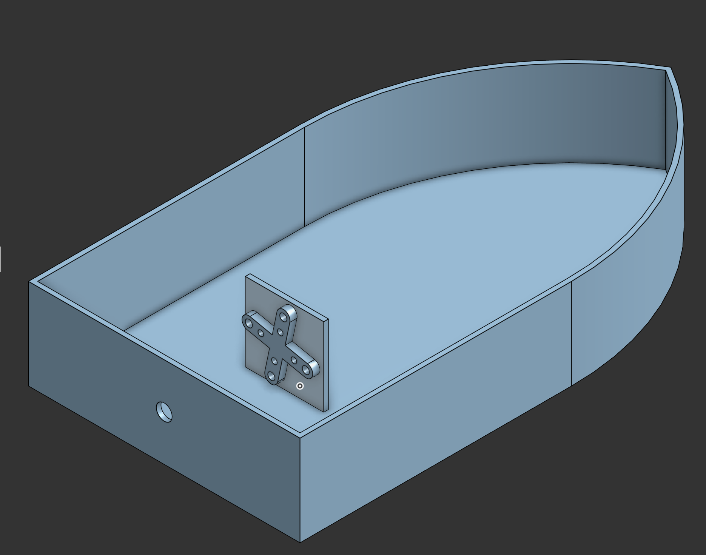
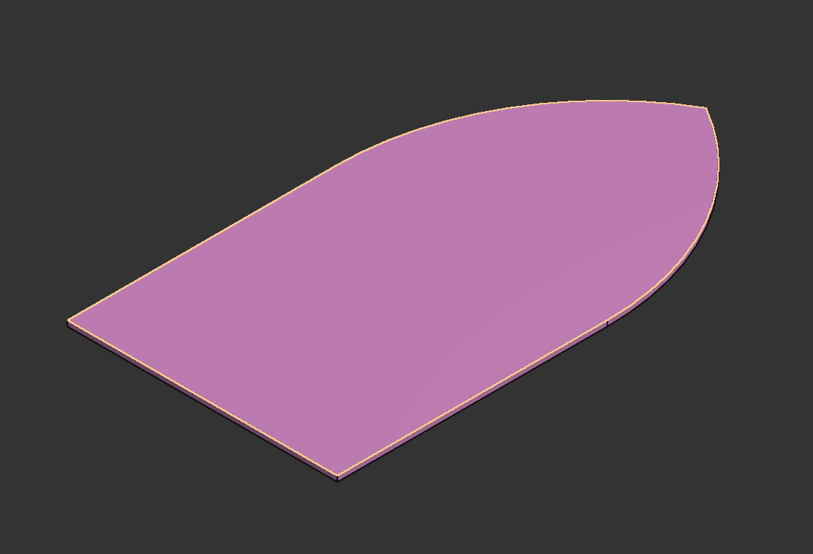
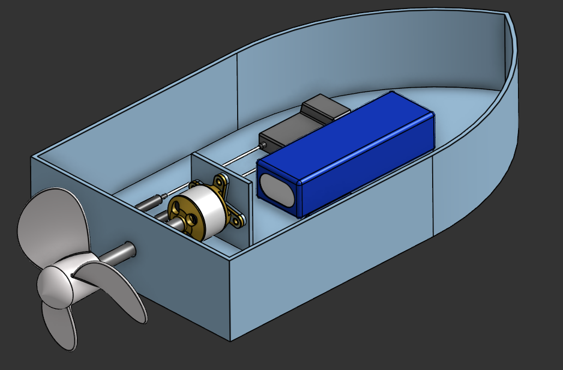

# Development Journal — RC Boat CAD

This journal tracks our weekly progress, hours, and decisions for the RC Boat project.

---

## Week 1 — Sept 14–20, 2026

### Goal
Design the full RC boat (hull + propeller + internals) and assemble everything in Onshape.

### Person A — Propeller (53 min)

**What I did:**
- Created a new Part Studio for the propeller
- Sketched the hub as a revolved profile
- Sketched two offset blade cross-sections and used **Loft** to create a twisted blade
- Applied **Circular Pattern** (3×) around the hub axis
- Added a shaft coupling bore (3 mm) through the hub
- Filleted blade edges for smoother flow

**Challenges:**
- First blade loft twisted the wrong way — fixed by reordering sketch planes
- Blade tip was too thin — added a small thickness offset

**Tools used:** Onshape (Loft, Revolve, Circular Pattern, Fillet)  
**Time logged:** 0.88 hours (53 min) via Lapse

---

### Person B — Hull, Deck, Motor Mount, Assembly (2h 21 min)

**What I did:**
- Sketched **4 cross-section stations** along the hull centerline
- Used **Loft** to create a smooth hull body
- Applied **Shell** to hollow the hull with 2 mm walls
- Created the **deck plate** as a separate part (pink)
- Designed a **cross-shaped motor mount** bracket with 4× M3 holes
- Modeled the **propeller shaft** (3 mm rod) and coupling
- Added electronic components:
  - Li-Po battery (blue box)
  - ESC / servo (blue module)
  - Motor + yellow mounting bracket
- Assembled everything in the **Assembly tab** with mates:
  - Fastened: motor mount → hull
  - Fastened: motor → mount
  - Revolute: propeller → shaft
  - Fastened: battery + servo → hull floor

---

### Images

| Hull  | Lid  |
| :---: | :---: |
|  |  |

| Assembly  | Slicer  |
| :---: | :---: |
|  |  |

---

**Challenges:**
- Hull was too narrow at the stern — adjusted station 4
- Motor mount hole spacing had to match the motor — measured twice, cut once
- Assembly mates kept flipping — fixed by adding an axis mate

**Tools used:** Onshape (Loft, Shell, Extrude, Fillet, Assembly mates)  
**Time logged:** 2.35 hours (2h 21 min) via Lapse

---

###  Ship of the Week

- **Repo:** [github.com/ArchanaKunwar/THIRD-SPACE-BOAT](https://github.com/ArchanaKunwar/THIRD-SPACE-BOAT)
- **Onshape doc:** [https://cad.onshape.com/documents/000ae551268fb42816427738/w/8f4ce627ee08794ee4e8480f/e/ccb63d3aac4362792a76f92b?renderMode=0&uiState=6aaa0e4445a0f105887e1505]
- **Combined hours this week:** 3.23 hours
- **Team total this week:** 3.23 / 20 hours 

---

